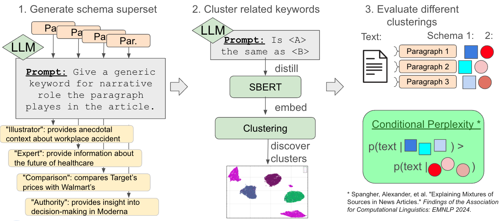

# schema-generation

In this project, we aim to build techniques for automatically inferring schemas for arbitrary questions. Our method for constructing schemas proceeds in three parts:



* __Step 1__: We generate a superset of schema tags by prompting an LLM (gray box) to label each input paragraph (orange boxes) with a keyword tag label (yellow boxes). We are testing to see how well this works for arbitrary schemas: so far, we have tested this with narrative-role schemas. In early experiments, we have found that schema superset generation should ideally be done without reference to any few-shot examples or guidance whatsoever, in order to get an unbiased and large superset.
* __Step 2__: We train a clustering algorithm to cluster similar elements in the schema superset together. In order to do this, we sample a small amount of similar pairwise examples, and prompt an LLM to identify if they are the same or not. Then, we use these silver-labels to fine-tune an SBERT embedding model. Next, we use this fine-tuned SBERT model to embed all of our labeled documents. Finally, we run UMAP+HDBSCAN on the fine-tuned embeddings to discover clusters.
* __Step 3__: Optionally, we test the efficacy of the schema. This can be useful for tuning hyperparameters. We use a method introduced in \[1\], called _latent perplexity_. In _latent perplexity_, an autoregressive GPT2 model is trained to take the schema elements of all paragraphs, and assess the likelihood of the observed text (this was tested for a scenario where all paragraphs in a document were labeled, alternatively, we can also test with a single document label to predict the entire document).

\[1\] Spangher, Alexander, et al. "Explaining Mixtures of Sources in News Articles." Findings of the Association for Computational Linguistics: EMNLP 2024. 2024.

# Schema Generation

This repository contains tools and utilities for schema generation based on logprobic scoring.

## Simplified API

The log probability scoring API has been simplified. The API now takes prompt and choices directly:

```python
# Example usage with vLLM
from src import build_vllm_logprob_fns

model_name = "meta-llama/Meta-Llama-3.1-8B-Instruct"
single_fn, batch_fn, full_fn = build_vllm_logprob_fns(model_name)

prompt = "What is the capital of France?"
choices = ["Paris", "London", "Berlin"]

# Score with single function
single_results = single_fn(prompt, choices)
# [score1, score2, score3]

# Score with batch function
batch_results = batch_fn(prompt, choices)
# [score1, score2, score3]

# Score full text
full_score = full_fn("What is the capital of France? Paris")
# score
```

### HuggingFace API

```python
from src import build_hf_logprob_fns

model_name = "meta-llama/Meta-Llama-3.1-8B-Instruct"
single_fn, batch_fn, full_fn = build_hf_logprob_fns(model_name)

prompt = "What is the capital of France?"
choices = ["Paris", "London", "Berlin"]

# Score with single function
single_results = single_fn(prompt, choices)

# Score with batch function
batch_results = batch_fn(prompt, choices)
```

### TogetherAI API

```python
from src import build_together_logprob_fns

model_name = "meta-llama/Llama-3-8b-instruct"
api_key = "your_together_api_key"  # or set TOGETHER_API_KEY env var
single_fn, batch_fn, full_fn = build_together_logprob_fns(model_name, api_key)

prompt = "What is the capital of France?"
choices = ["Paris", "London", "Berlin"]

# Score with single function
single_results = single_fn(prompt, choices)

# Score with batch function
batch_results = batch_fn(prompt, choices)
```

### Using with ProbabilityCalibrator

```python
from src import ProbabilityCalibrator, build_vllm_logprob_fns

model_name = "meta-llama/Meta-Llama-3.1-8B-Instruct"
single_fn, _, _ = build_vllm_logprob_fns(model_name)

calibrator = ProbabilityCalibrator(
    choices=["Choice A", "Choice B", "Choice C"],
    logprob_scorer=single_fn,
    prompt_template="Choose the best answer for: {question}\n\nYour response:"
)

# Get probabilities
probs = calibrator.calibrate_p_z_given_X("What is 2+2?")
# [prob_A, prob_B, prob_C]
```